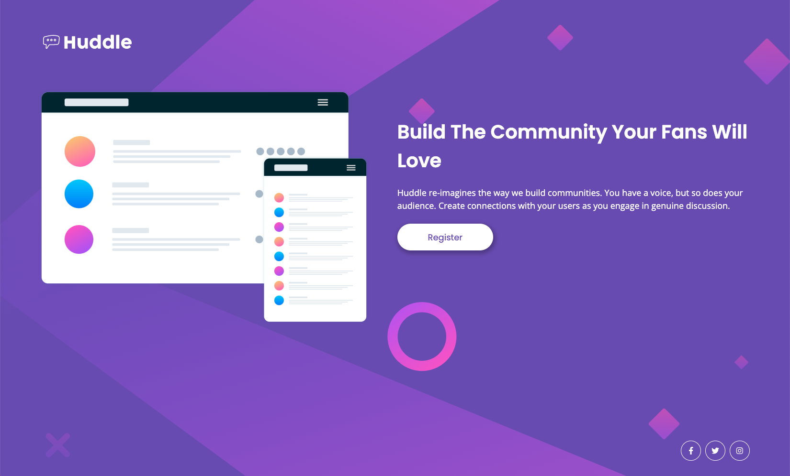

# Frontend Mentor - Huddle landing page with single introductory section solution

This is a solution to the [Huddle landing page with single introductory section challenge on Frontend Mentor](https://www.frontendmentor.io/challenges/huddle-landing-page-with-a-single-introductory-section-B_2Wvxgi0). Frontend Mentor challenges help you improve your coding skills by building realistic projects. 

## Table of contents

  - [The challenge](#the-challenge)
  - [Screenshot](#screenshot)
  - [Links](#links)
  - [Built with](#built-with)
  - [What I learned](#what-i-learned)
  - [Useful resources](#useful-resources)
- [Author](#author)

### The challenge

Users should be able to:

- View the optimal layout for the page depending on their device's screen size
- See hover states for all interactive elements on the page

### Screenshot

### Links

- Live Site URL: [Live Site](https://sarahimhof13.github.io/huddle-landing-page/)

### Built with

- Semantic HTML5 markup
- CSS custom properties
- Flexbox
- Mobile-first workflow

### What I learned
- How to set up a Git repository and use it for version control

### Useful resources

- [Start a new git repository](https://kbroman.org/github_tutorial/pages/init.html) - This helped me figure out how to start a new git repository and connect it to GitHub

## Author
- Frontend Mentor - [@sarahimhof13](https://www.frontendmentor.io/profile/sarahimhof13)
- Linkedin - [@sarah-imhof](https://www.linkedin.com/in/sarah-imhof)
